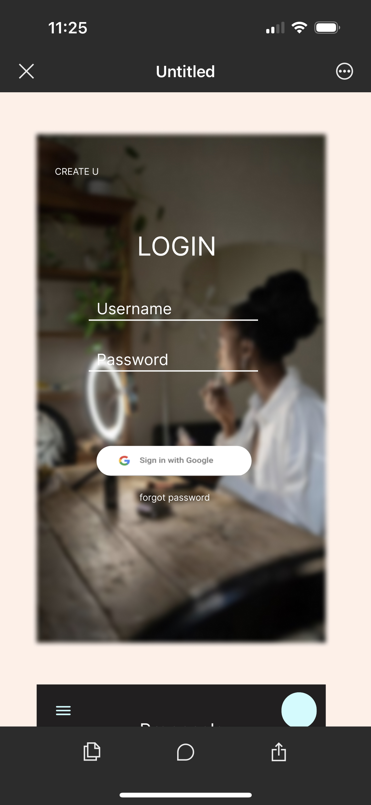
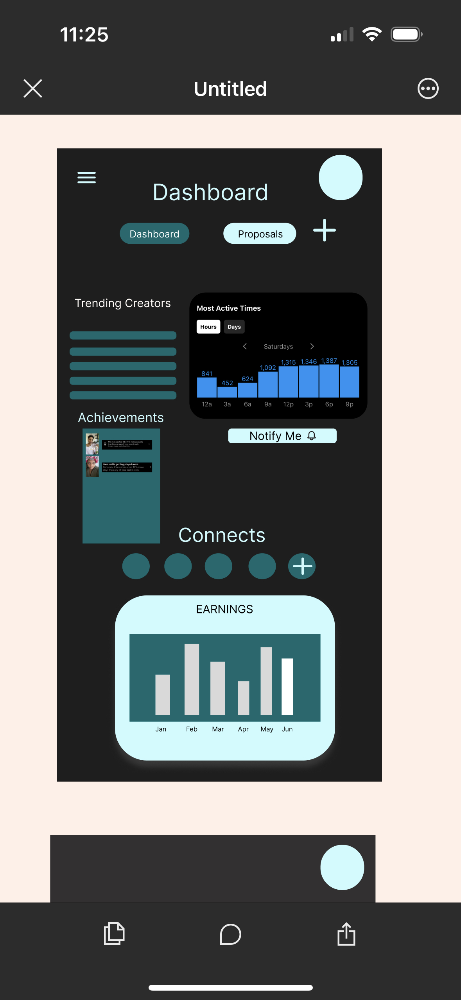
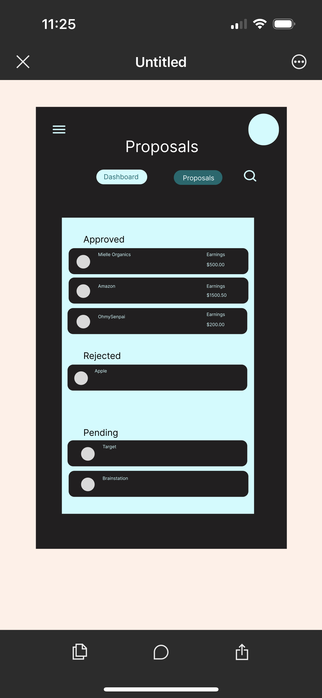
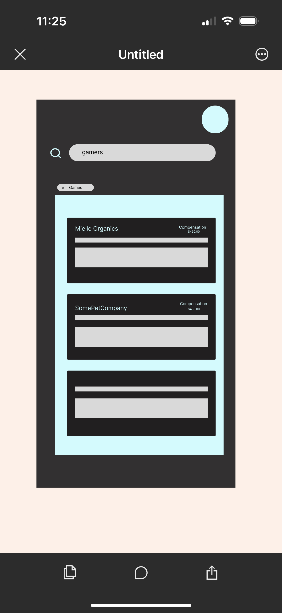

# CreateU

## Overview

Create U is an app targetted towards content creators who want to grow their platform & social connections while also making money through brand partnerships. The app aims to connect the creators with companies looking for promoters in their target audience that may not have the requirements necessary on other platforms to promote. 
### Problem

Many new content creators have litle to no understanding of their analytics and what the most important methods are for posting, It is also harder for smaller creators to grow and earn brand partnerships due to their following, so this app would assist them in being able to profit from their platforms.

### User Profile

Content creators, the goal is for it to have their analytics simplified so it would have to be very user friendly and broken down

### Features
Create and Implement Log in,
Authenticatiion using google,
Allow user to search for postings in A specific niche,
A user profile for content creators looking to promote for small-large businesses,
Ability to click on listing and it open A modal with complete proposal posting

## Implementation

### Tech Stack
JS,React,SASS,Firebase

### APIs

https://developers.google.com/identity/sign-in/web/sign-in
https://developers.facebook.com/docs/instagram-basic-display-api/getting-started

### Sitemap
Main page: includes Basic site info, pictures of example user analytics, A menu tab including the future features and current available ones, a proposal tab that leads you to your list of proposal applications and their status.

Log In page: Displays welcome text and prompts user to log in.

Proposals Page: Displays A list of jobs the user applied to and if it has been accepted, rejected or is still in oending status.

### Mockups

### Data

If i can, the data i would need would come from the users social pages after they log in with them. I would be able to use that data and adjust the more complicated words into eaasier to understand ones to help break down their purpose for the user. If not the data entered by the user to create their account would help my program pick their niche out of 5 possible options and using that niche i would have preprogrammed suggestions based off whats trending for those niches

### Endpoints

List endpoints that your server will implement, including HTTP methods, parameters, and example responses.

### Auth

I'm still trying to figure this portion out, the goal is to be able to log in to the users social media accounts which require auth, but im not sure if the social platforms would allow access to the data requested

## Roadmap

Sprint 1: The Skeleton & Design of the Site
Sprint 2: Adding functionality seeing what works and pivotting on what doesnt
Sprint 3: Testing and Debugging

## Nice-to-haves

Your project will be marked based on what you committed to in the above document. Under nice-to-haves, you can list any additional features you may complete if you have extra time, or after finishing.

 If im unable to get the social media authentication in this timeframe I woudld like to add it at a future time.
