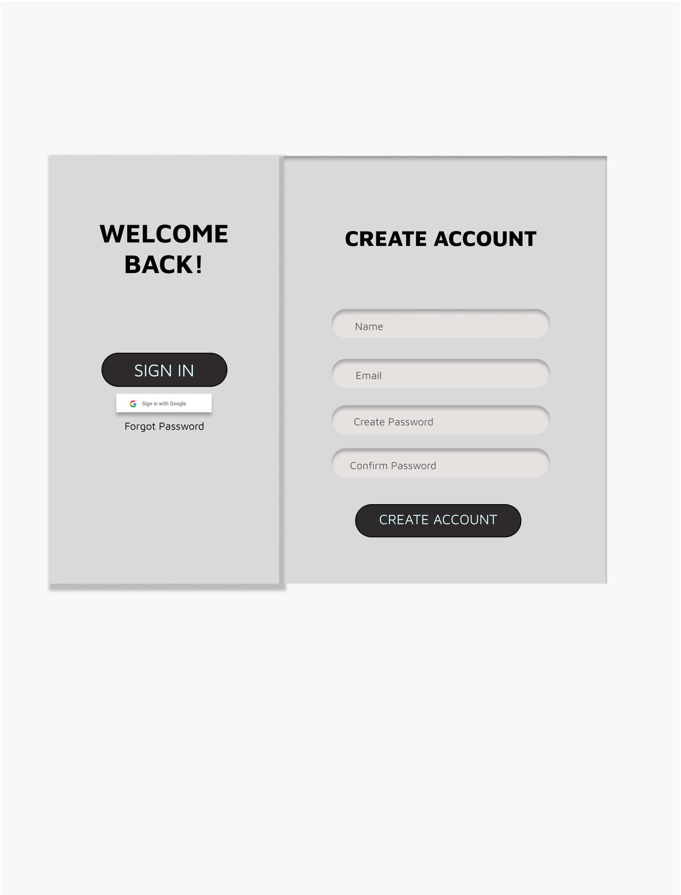
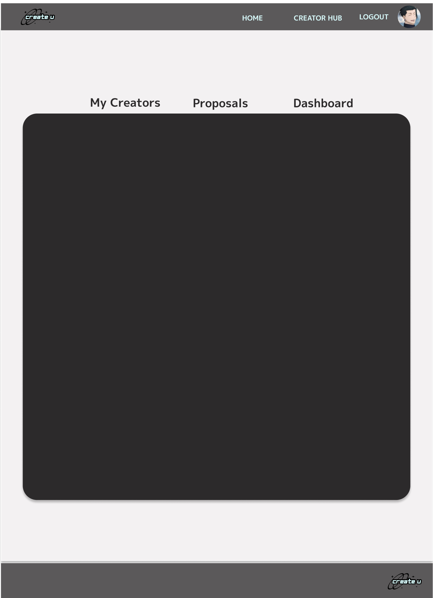
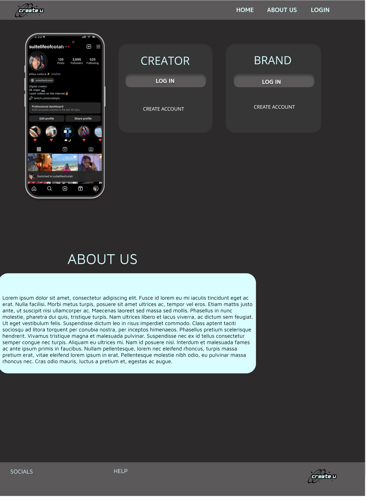

# CreateU

## Overview

A platform for content creators to get brand partnerships while also get insight to their social analytics

### Problem

Many new content creators have litle to no understanding of their analytics as theyre too compliccated to understand with no backgroound knowledge on it. It is also harder for smaller creators to grow and earn brand partnerships due to their following, so this app would assist them in being able to profit from their platforms.

### User Profile

Content creators, the goal is for it to have their analytics simplified so it would have to be very user friendly and broken down

### Features

Logging in using social platforms 
Display user niche 
Have both a Company side for those looking to find promoters and A user side for content creators looking to promote
Have authentication before users can promote on the app

## Implementation
The user can insert their niche name when they create an account or answer a couple of questions based on their usual content and pick the niche that shows as most similar 
Create two different UI's , one for cCreators and one for Businesses
Set up something to require authentication before a freelance oppurtunity is accepted or posted.

### Tech Stack
JS,React,SASS,SQL,C++

### APIs

https://developers.google.com/identity/sign-in/web/sign-in
https://developers.facebook.com/docs/instagram-basic-display-api/getting-started
https://dev.twitch.tv/docs/authentication/
https://stripe.com/docs/api

### Sitemap
Main page: includes Basic site info, pictures of example user analytics, an about tab, a log in tab and where to find us on socials.

Create Account page: Includes A couple of textboxes to intake user information

Log In page: Displays welcome text with users name, A short list of pictures that have possible company matches that are looking for promoters, A what they should post next tab

Analytics page: A very simplified version of the users analytics

### Mockups

### Data

If i can, the data i would need would come from the users social pages after they log in with them. I would be able to use that data and adjust the more complicated words into eaasier to understand ones to help break down their purpose for the user. If not the data entered by the user to create their account would help my program pick their niche out of 5 possible options and using that niche i would have preprogrammed suggestions based off whats trending for those niches

### Endpoints

List endpoints that your server will implement, including HTTP methods, parameters, and example responses.

### Auth

I'm still trying to figure this portion out, the goal is to be able to log in to the users social media accounts which require auth, but im not sure if the social platforms would allow access to the data requested

## Roadmap

Sprint 1: The Skeleton & Design of the Site
Sprint 2: Adding functionality seeing what works and pivotting on what doesnt
Sprint 3: Testing and Debugging

## Nice-to-haves

Your project will be marked based on what you committed to in the above document. Under nice-to-haves, you can list any additional features you may complete if you have extra time, or after finishing.
 If im unable to get the social media authentication in this timeframe I woudld like to add it at a future time.
